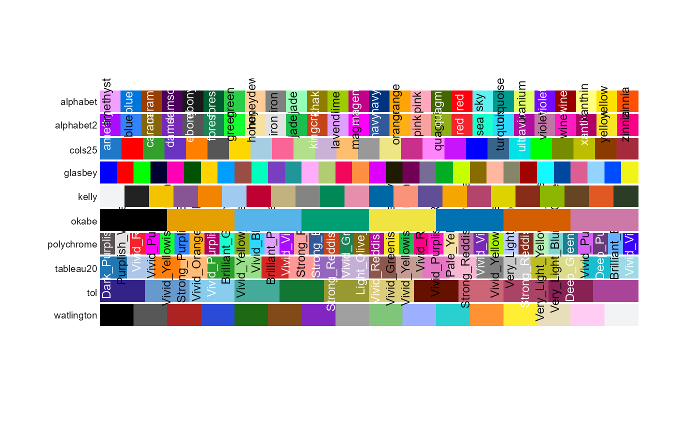

```{r setup, include=FALSE}
knitr::opts_chunk$set(echo = TRUE)
```

-   A form of supervised learning that assigns a polarity score to
    textual data.

-   Existing tools classify text based on a lexicon or a set of rules;
    aspects, or features of the text; or though deep learning.

-   Can analyse text at various levels (e.g. word/aspect, sentence,
    paragraph, document)

-   Designed to parse opinionated data

-   Some linguistic limitations include sarcasm, humor, slang, and
    connotation

## Research questions/aim

1.  Can we use sentiment analysis algorithms to automatically assess the
    polarity (+/-)trends in unstructured data (reviews of whiskies
    bottles)
2.  How this polarities values compare with general rates
3.  Which other sentiments can be detected by sentiments analysis
    algorithms
4.  How accurate are these algorithms and how can we use them

## Install and Load the packages that we need

Before we start playing around we need to install the needed packages
and load all the packages we need for the session

On Noteable

```{r Install Packages, results='hide'}
#install.packages("syuzhet") # Sentiment Analysis package
#install.packages("purrr")
#install.packages("tidytext") # Text Analysis 
#install.packages("Polychrome") # Palette
#install.packages("wordcloud")# wordcloud
#remotes::install_github("quanteda/quanteda.sentiment")#3
```

On Posit

```{r Install Packages Posit, results='hide'}
#install.packages("tidyverse")#only if not on the server already from yesterday
#install.packages("syuzhet") # Sentiment Analysis package
#install.packages("tidytext") # Text Analysis 
#install.packages("Polychrome") # Palette
#install.packages("wordcloud")# wordcloud
#install.packages("quanteda")# quanteda
#install.packages("remotes")
#remotes::install_github("quanteda/quanteda.sentiment")#3
#install.packages("RColorBrewer")# Colour palette
```

Load the Libraries NB you need to restart R before doing the library bit
or there will be dependencies errors

```{r Load Packages, echo=FALSE}
library(purrr)
library(syuzhet)
library(RColorBrewer)
library(tidytext)
library(Polychrome)
library(wordcloud)
library(quanteda.sentiment)
library(quanteda)
library(dplyr)
library(tidyverse)

```

## Load our data

The first thing to do is to import the dataset we are going to use. In
our case that is the full dataset of whiskies reviews we scrape this
morning. The version we obtain this morning is a reduce sample but let's
play with the full sample that was extracted by letting this morning
code running for a couple of days

```{r load data}

WhiskyReview <- read_csv("data/ReviewWithDistilleriesInfoV2.csv")

summary(WhiskyReview)
```

## Syuzhet

the syuzhet a sentiment analysis package, written by Matthew Jockers.
The term 'syuzhet' is Russian (сюже́т) and translates roughly as 'plot',
or the order in which events in the narrative are presented to the
reader, which may be different than the actual time sequence of events
(the 'fabula'). The syuzhet package similarly considers sentiment
analysis in a time-series-friendly manner, allowing you to explore the
developing sentiment in a text across the pages (from
<https://programminghistorian.org/en/lessons/sentiment-analysis-syuzhet>).

More information on the details of the package can be found here
<https://cran.r-project.org/web/packages/syuzhet/syuzhet.pdf>

We do not have time to go into the detail of how the algorithms works
but if you are going to use it for research make sure to read the
details of how the methods works

### Obtain the Sentiment Score for our Review field

```{r Syuzhet1}
SentimentScoresS <- get_nrc_sentiment(WhiskyReview$Reviews)


summary(SentimentScoresS)
```

### Visualise these data

```{r Syuzhet2}
barplot(
  colSums(prop.table(SentimentScoresS[, 1:10])),
  space = 0.2,
  horiz = FALSE,
  las = 1,
  cex.names = 0.7,
  col = brewer.pal(n = 10, name = "Set3"),
  main = "Whisky reviews",
  sub = "Sentiments within reviews",
  xlab="emotions", ylab = NULL)

```

### Discussion

What do you think we are looking at? How do you think the different
sentiments are extracted?

### Explore the results

To get a better insight of what is inside let's merge back the new
dataset with the original one

```{r Syuzhet3}
FullSentiment<-cbind(WhiskyReview,SentimentScoresS)
```

To be able to properly explore the data we need to rework the dataset
from a "wide" format to a "long" format

```{r Syuzhet4}
# Reshape the data from wide to long format, preserving other columns
long_dataWhisky <- gather(data = FullSentiment, 
                    key = "sentiment", #how do I want to rename the new column containing headers of the columns
                    value = "value", # how to call the values extracted
                    -(Distillery:Rate))# which columns do not need to be gatehered 
```

At this stage because we want to look at proportion of different
sentiment let's remove positive/negative

```{r Syuzhet5}
long_dataWhisky_Sentiments<-filter(long_dataWhisky,sentiment!="positive" & sentiment!="negative")
```

Now we can explore it better using ggplot First by Region

```{r Syuzhet6}
ggplot(long_dataWhisky_Sentiments, aes(x = sentiment, y=value, fill=sentiment)) + #Dataset, x, y and colour
  geom_bar(stat = "identity") + #type of graph
  labs(title = "Distribution of Sentiment Proportions", 
       x = "Sentiment", y = "value") + # rename labels
  theme_minimal()+ #Use a minimal theme
  theme(axis.text.x = element_text(angle = 90, vjust = 0.5, hjust=1))+ #rotate the labels of 90 degree
  facet_wrap(~Region, scales = "free_y") #subset by region and free the y axis
```

### Exercise one

Plot it subdividing by ownership of the distilleries.

Does the result change compared to the previous graph?

```{r Syuzhet7}

```

### Explore the words associated with each sentiment

Because it is a quite big dataset we will do it on a subset so we look
only at the Lowland sample

First subset the dataset to get only the Lowland whiskies reviews

```{r Syuzhet8}
Lowland<-subset(WhiskyReview, Region=="Lowland" )
```

Then we need to tokenise the new dataset

```{r Syuzhet9}
tokens <- Lowland %>%
  unnest_tokens(word, Reviews)

filtered_tokens <- tokens %>%
  filter(nchar(word) > 3 & !str_detect(word, "^[0-9]+$"))

words_list <- filtered_tokens %>%
  pull(word)


```

Now we can re run the nrc sentiment function

```{r Syuzhet10}
Lowlandsentiment_scoresT <- get_nrc_sentiment(words_list)

```

You can see that because we are now running the function on a tokenised
object it is much slower even if we are working on a much smaller
sample.

First let's focus on the words associated with joy

```{r Syuzhet11}
JoyWords <- words_list[Lowlandsentiment_scoresT$joy> 0]
head(JoyWords)
```

Let's see what are the most recurring ones

```{r Syuzhet12}
JoyWordsOrder <- sort(table(unlist(JoyWords)), decreasing = TRUE)
head(JoyWordsOrder, n = 12)

```

Convert the table to a data frame and rename the variables word and
frequency

```{r Syuzhet13}
JoyDF <- as.data.frame(JoyWordsOrder)
names(JoyDF) <- c("word", "frequency")
```

Because we have a lot words we want a bigger colour palette. Glasbey is
a colour palette from the Polychrome Palette



```{r Syuzhet14}
color_palette <- glasbey.colors(32) 
```

Now we can print the most recurring words of Joy as a wordcloud

```{r Syuzhet15, fig.width=8, fig.height=8}
wordcloud(words = JoyDF$word,
          freq = JoyDF$frequency,
          scale=c(8,2),# rage of font sizes
          colors=color_palette,
          random.order=FALSE, rot.per=0.35,
          max.words =100)
```

Or if I want to plot frequencies

```{r Syuzhet16}
First20JoyDF<-JoyDF%>%
  arrange(desc(frequency))%>%
  head(20)
#aes(x = reorder(word,-frequency), y = frequency))
ggplot(First20JoyDF, aes(x = reorder(word,-frequency), y = frequency, colour=reorder(word, -frequency))) + # Plotting with ggplot2
  geom_point(size=5) +
  theme_bw() +
  labs(x = "Term", y = "Frequency") +
  theme(axis.text.x=element_text(angle=90, hjust=1))
```

### Discussion

What is this telling about the words associate with Joy in our sample?

What about terms associated with disgust? Write your code below

```{r Syuzhet17}

```

### Positive and Negative words

So far we looked at specific sentiment but what about positive and
negative feelings First we need to subset for only positive and negative

```{r Syuzhet18}
long_dataWhisky_PN<-filter(long_dataWhisky,sentiment=="positive" | sentiment=="negative")
```

Now we can plot the Distribution of Sentiment Proportions

```{r Syuzhet19}
ggplot(long_dataWhisky_PN, aes(x = sentiment, y=value, fill=sentiment)) +
  geom_bar(stat = "identity") +
  labs(title = "Distribution of Sentiment Proportions",
       x = "Sentiment", y = "value") +
  theme_minimal()+
  facet_wrap(~Region, scales = "free_y")
```

again not too easy to look at let's use a pipe to create better
proportions

```{r Syuzhet20}
proportionsArea <- long_dataWhisky_PN %>%
  group_by(Region,sentiment)%>%
  summarise(count= sum(value))%>%
  mutate(Ratio=(round(count/sum(count),2)*100))
  

ggplot(proportionsArea, aes(x = sentiment, y=Ratio, fill=sentiment)) +
  geom_bar(stat = "identity") +
  labs(title = "Distribution of Sentiment Proportions",
       x = "Sentiment", y = "value") +
  geom_text(aes(label = Ratio), position = position_stack(vjust = 0.5), color = "black") +
  theme_minimal()+
  facet_wrap(~Region)

```

This is only counting words or proportion that has a negative or
positive association what if we try to use a different sentiment
dictionary.

**NB** there is an incredible amount of dictionaries and sentiment
analysis models out there some more refined than others so if you are
using sentiment analysis for your research you always have to read the
published article associated with the methods and identify the one that
would better suit your research questions. Some are more advanced than
other with some recent model than allows you to implement machine
learning and Bayesian techniques into your processing but this is way
beyond what we can cover in this 90 minutes if you are interested in
that aspect you can have a look at this blog post
<https://www.r-bloggers.com/2016/01/sentiment-analysis-with-machine-learning-in-r/>

That been said let's have a look at a different library to do sentiment
analysis i.e. the sentiment extension of the Quanteda package

## Quanteda

First we need to Tokenise our reviews with Quanteda (NB each text
analysis package would output slightly differently so if you use the
sentiment package of Quanteda you need to tokenise with Quanteda )

```{r Quanteda1}
ToksReviewsQuanteda <- WhiskyReview$Reviews %>% 
  corpus() %>%
  tokens(
    what = "word",
    remove_punct = TRUE,
    remove_symbols = TRUE,
    remove_numbers = TRUE
  ) %>% 
  tokens_remove(., pattern = stopwords("en"))

head(ToksReviewsQuanteda)

```

The data dictionary that we are using has 4 categories, positive,
negative and neg_positive and neg_negative
<https://quanteda.io/reference/data_dictionary_LSD2015.html>

We subset the data dictionary for only the positive and negative words,
so we can calculate polarity scores

```{r Quanteda2}
polarity(data_dictionary_LSD2015) <- 
  list(pos = c("positive", "neg_negative"), neg = c("negative", "neg_positive"))
```

Now we can calculate the polarity of each text in toks, to get a sense
of how positive vs negative each text is.

There are three way this can be done

### Sentiment Measures

**`sent_logit`:**

$$
\log\left(\frac{\text{pos}}{\text{neg}}\right)
$$

This measure represents the logarithm of the ratio of positive to
negative features in a document. It's also known as the log-odds ratio.
This can be interpreted as:

-   When $\text{pos} > \text{neg}$, the value will be positive,
    indicating a predominance of positive features.
-   When $\text{pos} < \text{neg}$, the value will be negative,
    indicating a predominance of negative features.
-   When $\text{pos} = \text{neg}$, the value will be zero, indicating
    an equal number of positive and negative features.

**`sent_abspropdiff`:**

$$
\frac{\text{pos} - \text{neg}}{N}
$$

This measure represents the absolute proportion difference between
positive and negative features, normalized by the total number of all
features in the document ($N$). Here:

-   $\text{pos} - \text{neg}$: This is the net sentiment, showing the
    difference between the number of positive and negative features.
-   $N$: This is the total number of features in the document (both
    positive and negative).

This measure gives an idea of how much more (or less) positive features
there are compared to negative ones, in relation to the total number of
features.

-   A positive value indicates more positive features.
-   A negative value indicates more negative features.
-   A value close to zero indicates a balance between positive and
    negative features.

**`sent_relpropdiff`:**

$$
\frac{\text{pos} - \text{neg}}{\text{pos} + \text{neg}}
$$

This measure represents the relative proportion difference between
positive and negative features, normalized by the sum of positive and
negative features. Here:

-   $\text{pos} - \text{neg}$: This is the net sentiment, showing the
    difference between the number of positive and negative features.
-   $\text{pos} + \text{neg}$: This is the total number of sentiment
    features (positive and negative).

This measure gives a relative sense of the balance between positive and
negative features:

-   A value of +1 indicates that all features are positive
    ($\text{neg} = 0$).
-   A value of -1 indicates that all features are negative
    ($\text{pos} = 0$).
-   A value of 0 indicates an equal number of positive and negative
    features.

**Summary:**

-   `sent_logit` measures the log-odds ratio, which gives a logarithmic
    scale of the balance between positive and negative features. Values
    between -/+ infinite
-   `sent_abspropdiff` measures the absolute difference between positive
    and negative features normalized by the total number of features,
    giving an absolute proportion difference. Values between -1 and +1
-   `sent_relpropdiff` measures the relative difference between positive
    and negative features normalized by their sum, giving a relative
    proportion difference.Values between -1 and +1

```{r Quanted3}
Polarity1 <- as.data.frame(textstat_polarity(ToksReviewsQuanteda, data_dictionary_LSD2015, fun = sent_logit))

head(Polarity1)
```

This is the default one so we do not really have to specify the fun used
but to completeness.

Now with **sent_abspropdiff**

```{r Quanteda4}
Polarity2 <- textstat_polarity(ToksReviewsQuanteda, data_dictionary_LSD2015,  fun = sent_abspropdiff)
head(Polarity2)
```

Now with **sent_relpropdiff**

```{r Quanteda5}
Polarity3 <- textstat_polarity(ToksReviewsQuanteda, data_dictionary_LSD2015,  fun = sent_relpropdiff)
head(Polarity3)
```

Let's compare our results

```{r Quanteda6}
summary(Polarity1$sentiment) #can go from -n +n 
summary(Polarity2$sentiment) #can go from -1 +1
summary(Polarity3$sentiment) #can go from -1 +1
```

Let's Plot Polarity 1

```{r Quanteda7}
ggplot(data = Polarity1, aes(x = sentiment, y = doc_id, colour=sentiment)) +
  geom_point()+
  theme_bw()+
  geom_vline(xintercept = 0, colour="red", size=1)+
  scale_colour_gradientn(colors=rainbow(7)) +
  theme(axis.text.y=element_blank(),
        axis.ticks.y=element_blank())#I removed the thick and labels of the y axis cause we don't really need to know which is which 
```

### Exercise

How does it change for the other two methods? Write your code below

```{r Quanteda8}

```

## Compare rate with polarity

Because we are collecting reviews of whisky we not only have the text of
the review but also a rate that was associated with the bottle let's see
how the different methods of computing the polarity and these rate
compare.

The first thing we need to do is to linearly transform the original -1+1
scales into 0-100

**NB** we cannot do this for the logarithmic option because it is not on
a -1+1 scale

```{r Quanteda9}
transformedPol2 <- ((Polarity2$sentiment + 1)) * 50
transformedPol3 <- ((Polarity3$sentiment + 1)) * 50
```

We then create a new dataset containing the new calculated fields

```{r Quanteda10}
FullPolarity<-cbind(WhiskyReview,doc_id=Polarity1$doc_id,PolAbspropdiff=transformedPol2, PolRelpropdiff=transformedPol3)

```

Lets do the same for the Syuzet one\
First obtain the polarity

```{r Quanteda11}
FullSentiment <- FullSentiment %>%
  mutate(scaledPolarity =  ((positive - negative) / (positive +negative)))
```

Then scale it between 0-100

```{r Quanteda12}
FullPolarity$syuzhetPolarity <- ((FullSentiment$scaledPolarity + 1)) * 50
summary(FullPolarity$syuzhetPolarity)
```

Now we can finally compare the different methods and the rates

First we remove the rows for which we do not have rate data

```{r Quanteda13}
df_clean <- FullPolarity[complete.cases(FullPolarity$Rate), ]
```

Because we need to use gather again to create a long dataset we also
need to change the order of the columns so that we have all the
variables that we want to ignore in the gather at the start

```{r Quanteda14}
df_cleanSub <- df_clean[,c(1:8,10,9,11:13)]
```

Now we can reshape in the long format

```{r Quanteda15}
data_long <- tidyr::gather(df_cleanSub,
                           key = "Rate_Sentiment",
                           value = "value",
                           -(Distillery:doc_id))
```

And finally we can plot it

```{r Quanteda16}
ggplot(data_long, aes(x = doc_id, y = value, color = Rate_Sentiment,group = Rate_Sentiment)) +
  geom_line() +
  labs(title = "Linear Relationship of Three Variables",
       x = "X", y = "Value") +
  theme_minimal()+
  theme(
    axis.title.x = element_blank(),  # Remove x-axis label
    axis.text.x = element_blank(),   # Remove x-axis tick labels
    axis.ticks.x = element_blank()   # Remove x-axis tick marks
  )

```

Plot the graph but this time by region

```{r Quanteda17}
ggplot(data_long, aes(x = doc_id, y = value, color = Rate_Sentiment,group = Rate_Sentiment)) +
  facet_wrap(~Region, scales = "free_x", ncol=2)+
  geom_line() +
  labs(title = "Linear Relationship of Three Variables",
       x = "X", y = "Value") +
  theme_minimal()+
  theme(
    axis.title.x = element_blank(),  # Remove x-axis label
    axis.text.x = element_blank(),   # Remove x-axis tick labels
    axis.ticks.x = element_blank()   # Remove x-axis tick marks
  )

```

## Final Discussion

Which method do you think is more accurate or better better reflect the
rate given to the bottle ?

## End of this Block!
