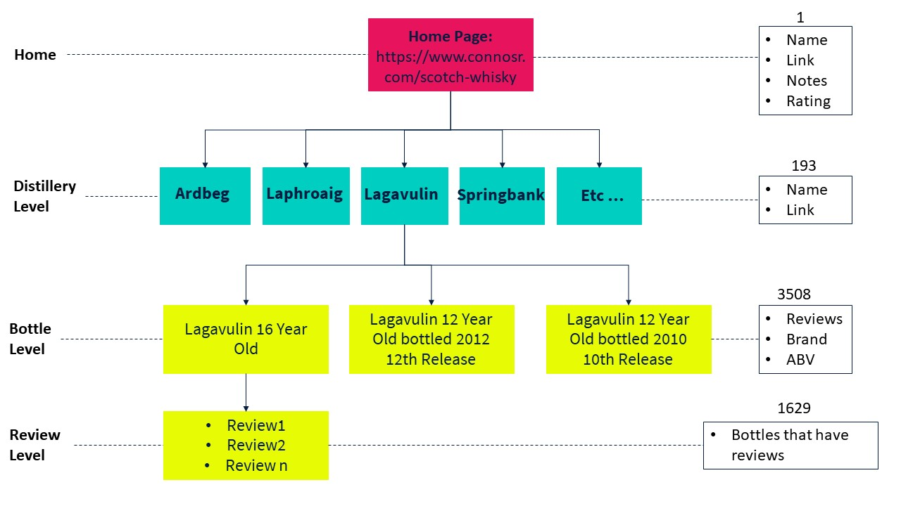

```{r setup, include=FALSE}
knitr::opts_chunk$set(echo = TRUE)
```

# Web Crawling

A web crawler, crawler or web spider, is a computer program that's used to search and automatically index website content and other information over the internet. Basically we are going to go through the tree of information of a website and collect nested information

## Set up

The first thing that we need is to call the library we need


Only if you are running on Posit
```{r installPosit, warning=FALSE, message=FALSE}
#install.packages("tidyverse")#only if not on the server already from yesterday
#install.packages("rvest")#Webcrawling
```


Load the libraries
```{r libraries}
library(tidyverse)
library(rvest)
```

## Explore the website

First let's explore it (<https://www.connosr.com/>)[<https://www.connosr.com/>]

Ok so what is the structure we are looking at 

## Level 1: homepage level

We established that the first level of our information is on the (Scotch Whiskys sub-folder)[<https://www.connosr.com/scotch-whisky>] and that would be the first object we need to set

```{r homepage, echo=TRUE}
Homepage <- 'https://www.connosr.com/scotch-whisky'
```

Unlike Python, the preferred approach to web scraping in R will be functional, not iterative. This means instead of for loops, we will write and map functions over our HTML.

In RVest, the typical approach is to figure out the task we want to perform, write a function to perform this task, and then map the function over a list of objects

Our next task is to get the links to each article on each of our pages. We can write a function for this, then then map it over the pages

So we start from setting a new function that would do so that we will map on the home page

### Get all the link to the Distilleries

```{r List distilleries, echo=TRUE}
get.article.links <- function(x){
  links <- read_html(x) %>%
    html_nodes('.name') %>%
    html_attr('href')
}

DistLinks <- map(Homepage, get.article.links) #map the function onto the home page 

length(DistLinks) # let's check how long the object is
```

What is wrong with this object? We get a list of lists, not a list. This will make it difficult to map over our variable, since each item has multiple items within it. So we need to use the flatten function to deal with this

```{r List distilleries Cleaning}
DistLinksFlat <- flatten(DistLinks) #Flat the list of list

head(DistLinksFlat) # See how it changed

length(DistLinksFlat) # Check new length

Links <-unlist(DistLinksFlat)#Finally we unlist the object so it will now be a vector

```

One last thing we need to do is to add the home page link to our list of links we can do this using Paste0

```{r Add Full Links}
FullLinks<- paste0("https://www.connosr.com", Links)

```

### Get Names distilleries

```{r Get Names Distilleries}
get.dist.names <- function(x){
  names <- read_html(x) %>%
    html_nodes('.name') %>%
    html_text()
}

DistNames <- map(Homepage, get.dist.names) #map them across

length(DistNames)
```

Again we will need to flatten our list of lists So we need to use the flatten function to deal with this

```{r FlatNames, echo=FALSE}
DistNamesFlat <-flatten(DistNames)

length(DistNamesFlat)

DistNamesFlat <-unlist(DistNamesFlat)

head(DistNamesFlat)
```

Remove initial letters followed by a space

```{r Remove extra letters}
cleanedNames <- sub("^\\w+\\s", "",DistNamesFlat)#using regex 
```

### Get the Notes of each distilleries

```{r Get Notes}
get.notes <- function(x){
  links <- read_html(x) %>%
    html_nodes('.align-right') %>%
    html_text()
}
Notes <- map(Homepage, get.notes)

```

So we need to use the flatten function to deal with this

```{r Clean Notes}
NotesFlat <- Notes %>% 
  flatten()

head(NotesFlat)
length(NotesFlat)

NotesFlat<-unlist(NotesFlat)

head(NotesFlat)
```

And we will also need to remove the "Common tags:" bit

```{r Clean Notes 2}
# Remove common tags: 
cleanedNotes <- sub("Common tags: ", "", Notes)
```

### Get Rate of the Distillery

```{r Rate Disitlleries}
get.rate.dist <- function(x){
  links <- read_html(x) %>%
    html_nodes('.not-small-phone') %>%
    html_text()
}

RateDist <- map(Homepage, get.rate.dist)#map it across

```

So we need to use the flatten function to deal with this

```{r Clean Rate}
RateDistFlat <-flatten(RateDist)

head(RateDistFlat)# look at the top
length(RateDistFlat)# how long it is

RateDist<-unlist(RateDistFlat)# unlist it

```

Remove "Average rating:"

```{r Clean Rate3}
cleanedRateDist <- sub("Average rating: ", "", RateDist)
cleanedRateDist <-as.numeric(cleanedRateDist)
```

Now we go one level down, i.e. the distilleries pages

### Merge the distilleries info and export

```{r Merge and export}
DistilleriesDataset<-data.frame(Links=FullLinks,DistNames=cleanedNames, DistNotes=cleanedNotes,DistRate= cleanedRateDist)
write_csv(DistilleriesDataset, "export/distilleries.csv")
```

## Level 2: Distilleries pages

You are going to notice that the scraping part will start require more time from now on because we are multiplying the number of pages for which we need to do it from one to 192 and when we are going to move one level down it will be more than 3500 bottles

### Get bottle links

```{r Bottle Links}
get.bottle.link <- function(x){
  links <- read_html(x) %>%
    html_nodes('.name') %>%
    html_attr('href')
}
BottleLinks <- map(FullLinks, get.bottle.link)

```

As for the other we need to do some cleaning

```{r Clean bottle links}
#We need to use the flatten function to deal with this
BottleLinksFlat <-flatten(BottleLinks)
head(BottleLinksFlat)
length(BottleLinksFlat)
BottleLink <-unlist(BottleLinksFlat)
FullLinksBottle<- paste0("https://www.connosr.com", BottleLink)
head(FullLinksBottle)
```

### Get name from links

Now we have the links of each bottle page but we want the names as well

```{r Get names bottles}
get.bottle.name <- function(x){
  links <- read_html(x) %>%
    html_nodes('.name') %>%
    html_text()
}

BottleName<- map(FullLinks, get.bottle.name )

```

So we need to use the flatten function to deal with this

```{r Clean names}

BottleNameFlat <- flatten(BottleName)
head(BottleNameFlat)
length(BottleNameFlat)

BottleNames <-unlist(BottleNameFlat)
```

now we go one level down to the reviews

## Level 3: reviews

### Get Reviews

Now we are working on a list 3508 observations long this is a lot. So to speed up this bit we are going to work on a subset of the list of links. If you want to work on the full list it can take around 10 mins for each function to run. You can do so by subbing "TestLinks" with "FullLinksBottle"

```{r SubsetBottleDataset}
TestLinks<-head(FullLinksBottle, 120)
```

```{r Get reviews}
get.bottle.reviews <- function(x){
  links <- read_html(x) %>%
    html_nodes('.simple-review-content p') %>%
    html_text()
}

BottleReviewS<- map(TestLinks, get.bottle.reviews)

#nb we are not doing a head() because it would print the first 6 levels of the top list that corresponds to hundred and hundred of reviews
```

Now we have a very long list of reviews but because we are actually interested in doing sentiment analysis by bottle we need to merge all the reviews by bottle and remove all empty reviews

### Merge together all reviews of each bottle

We can do this using a combination of lapply and Unlist

```{r Mergesublists}
merged_listS <- lapply(BottleReviewS, unlist)
```

Convert merged list to character vectors and concatenate them into a single string We can do this by using sapply and concatenating each review with a space

```{r Mergesublists2}
merged_stringsS <- sapply(merged_listS, function(x) paste(x, collapse = " "))
```

```{r Mergesublists3}
ReviewByBottleS <- data.frame(review = merged_stringsS)

# Create a dataframe with the original vector and its index
WithBottleNamesS <- data.frame(BottleName = head(BottleNames,120), review= ReviewByBottleS$review)
```

### Getting the Brand

in the single bottle pages there are info about the brand(distillery) because we may want to merge the review dataset back with the dataset containing information about the reviews we want to collect this information as well

```{r Get Brand}
get.bottle.dist <- function(x){
  links <- read_html(x) %>%
    html_node('.data a') %>%
    html_text()
}
BottleDistS<- map(TestLinks, get.bottle.dist)

# So we need to use the flatten function to deal with this
BottleDistFlatS <-flatten(BottleDistS)

length(BottleDistFlatS)

BottleDistFlatS <-unlist(BottleDistFlatS)

```

### Getting the ABV values

The other information we can collect from the single bottle page is the level of alchool in the bottle the process is exactly the same of that for getting the Brand

```{r Get ABV}
get.bottle.abv <- function(x){
  links <- read_html(x) %>%
    html_node('abbr+ .data') %>%
    html_text()
}

BottleABVS<- map(TestLinks, get.bottle.abv)


# So we need to use the flatten function to deal with this
BottleABVFlatS <-flatten(BottleABVS)

head(BottleABVFlatS)
length(BottleABVFlatS)

BottleABVFlatS <-unlist(BottleABVFlatS)
```

We need to do some more cleaning sot that the ABV percentage is encoded as a number rather than a carachter

```{r Clean AVB}
cleanedBottleABVS<- sub("%", "", BottleABVFlatS)
cleanedBottleABVS<-as.numeric(cleanedBottleABVS)
```

Now we merge all of this together

```{r Merge all together}
FullDataSetS<- data.frame(AVB=cleanedBottleABVS, Distillery= BottleDistFlatS, BottleName=WithBottleNamesS$BottleName, Reviews= WithBottleNamesS$review)
```

Finally we remove rows where the "review" column contains the specified strings

```{r Remove empty reviews}
filtered_Reviews <-FullDataSetS  %>%
  filter(!grepl("There are no community reviews of|Review this whisky", Reviews))%>%
  na.omit
```

Now we want to merge it with the dataset we have containing more info about the distilleires

### import the list of info about distilleries

```{r import}
List_of_whisky_distilleries <- read_csv("data/List_of_whisky_distilleries.csv")
```

Now we just need to merge them and re-export

```{r merge and export}
WithDistInfoS<- merge(List_of_whisky_distilleries, filtered_Reviews, by= "Distillery")

write_csv(WithDistInfoS,"ReviewWithDistilleriesInfoS.csv")
```

# THE END
